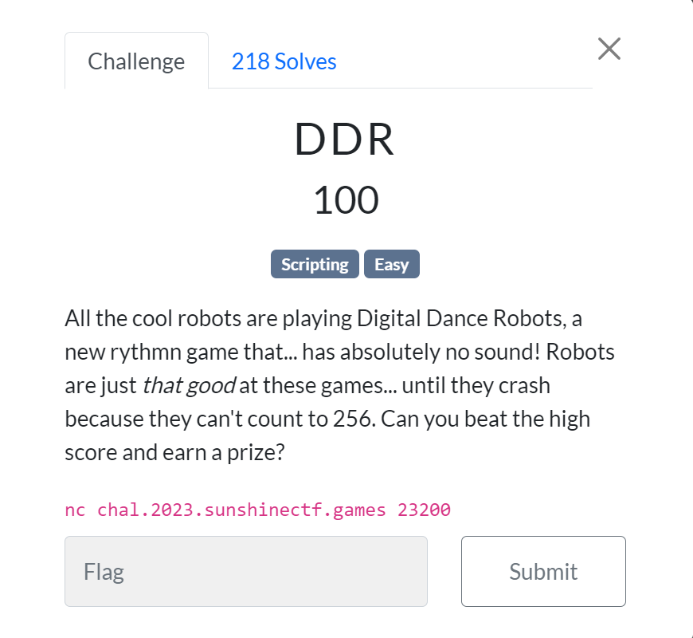
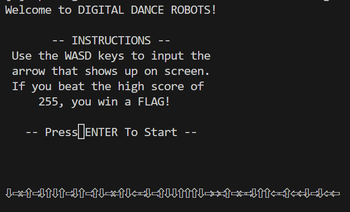
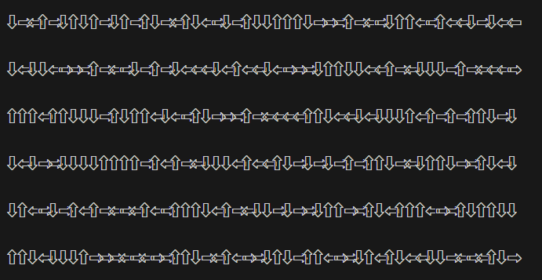
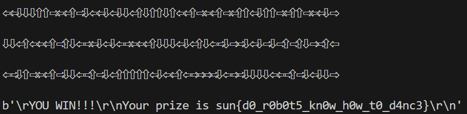

# DDR

## Задание



Посмотрим на задание



## Решение

В ответ необходимо отправить последовательность из символов WASD, после чего мы получим новый набор стрелок.



Напишем скрипт

```python
from pwn import *
con = remote('chal.2023.sunshinectf.games', 23200)
print(con.recv().decode())
con.send("\n".encode("utf-8"))
for k in range(256):
    res =  con.recvline().decode()
    print(res)
    ans = ""
    for i in range(len(res)-1):
        if res[i] == "⇧":
            ans += "W"
        if res[i] == "⇦":
            ans += "A"
        if res[i] == "⇩":
            ans += "S"
        if res[i] == "⇨":
            ans += "D"
    ans += "\n"
    ans = ans.encode("utf-8")
    con.send(ans)
print(con.recv())
print(con.recv())
```

Скрипт будет проходить тесты, пока не побьет рекорд в 225, после чего сервер вышлет флаг.



```python
b'\rYOU WIN!!!\r\nYour prize is sun{d0_r0b0t5_kn0w_h0w_t0_d4nc3}\r\n'
```
