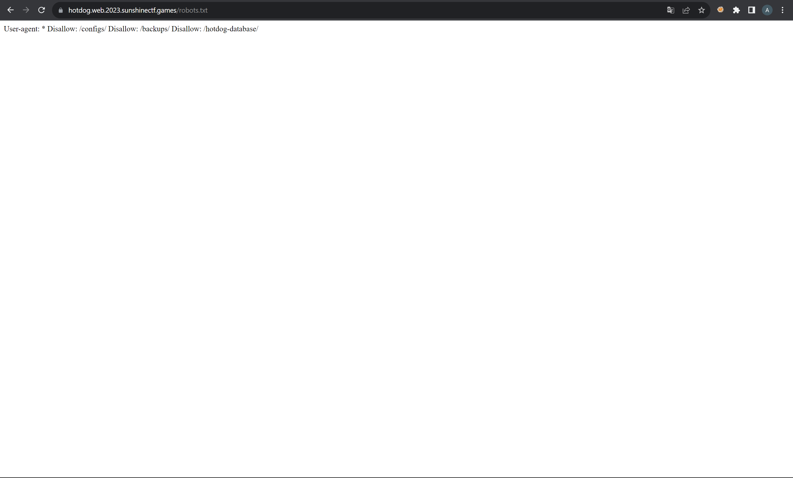

# Hotdog_Stand

## Задание


Взглянем на сайт.


Главная страница представляет собой базовую аутентификацию, посмотрим есть ли на сервере что-что кроме этой страницы.

## Решение



Заметим, что на сервере присутствует файл robots.txt, в нем можно увидеть базу данных, которую можно скачать. Откроем ее.


Написав SQL запрос, получаем логин и пароль. Проходим аутентификацию и получаем флаг.


```jsx
sun{5l1c3d_p1cKl35_4nd_0N10N2}
```
